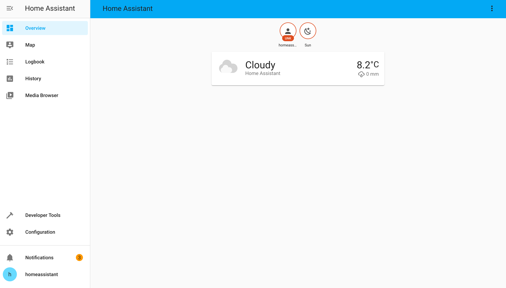

# Homeassistant on OpenWrt

This repo provides tools to install the latest version of Home Assistant that supports python 3.7 (2021.1.5)
on a system with OpenWrt 19.07 installed. It provides the reduced version of HA with only minimal list of components 
included. Additionally, it keeps MQTT and ZHA components as they are 
widely used with smart home solutions.

It is distributed with a shell script that downloads and installs everything that required for a clean start.

### Requirements:
- 120 MB storage space (256 recommended)
- 128 MB RAM
- OpenWrt 19.07 installed


## Xiaomi Gateway installation

Add the openlumi feed to gain access to a few precompiled python requirements.
Skip this step if you have already added this feed.

```sh
(! grep -q openlumi /etc/opkg/customfeeds.conf) && (
wget -q https://openlumi.github.io/openwrt-packages/public.key -O /tmp/public.key && 
opkg-key add /tmp/public.key && rm /tmp/public.key &&
echo 'src/gz openlumi https://openlumi.github.io/openwrt-packages/packages/19.07/arm_cortex-a9_neon' >> /etc/opkg/customfeeds.conf &&
echo "Feed added successfully!"
) || echo "Feed added already. Skip."
```

Then go to generic installation

## Other devices

You have to compile ipk packages for `python3-ciso8601` and `python3-pynacl` or get it for your system from
any sources. This repo provides makefiles for these packages.
OpenWrt 21.2 and master branches already have this packages.
Compilation process is widely described on the site of the OpenWrt project.


## Generic installation
Then, download the installer and run it.

```sh
wget https://raw.githubusercontent.com/openlumi/homeassistant_on_openwrt/main/ha_install.sh -O - | sh
```

After script prints `Done.` you have Home Assistant installed. 
Start the service or reboot the device to get it start automatically.
The web interface will be on 8123 port after all components load.



The only components with flows included are MQTT and ZHA.
After adding a component in the interface or via the config
HA could install dependencies and fails on finding them after installation.
In this case restarting HA could work.

Other components are not tested and may require additional changed in 
requirement versions or python libraries.

## ZHA usage on Xiaomi Gateway

The component uses internal UART to communicate with ZigBee chip.
The chip has to be flashed with a proper firmware to be able to 
communicate with the HA. The recommended firmware is 

https://github.com/openlumi/ZiGate/releases/download/v3.1e/ZiGate_31e_JN5169_COORDINATOR_115200.bin

You could try another Zigate firmwares for JN5169 chip. The baud rate
must be 115200 as it is hardcoded in zigpy-zigate.

**NOTE: It may require restarting Home Assistant after adding a new 
component via the UI to let it see newly installed requirements. 
E.g. ZHA installs paho-mqtt and will not allow configuring it unless HA is 
restarted.**

## Enabling other components and installing custom

You may want to add more components to your HA installation.
In this case you have to download tar.gz from PyPI:
https://pypi.org/project/homeassistant/2021.1.5/#files
Then extract the content and copy the required components to 
`/usr/lib/python3.7/site-packages/homeassistant-2021.1.5-py3.7.egg/homeassistant/components`
If the component uses the frontend wizard, you may want to uncomment the
corresponding line in 
`/usr/lib/python3.7/site-packages/homeassistant-2021.1.5-py3.7.egg/homeassistant/generated/config_flows.py`
also.

Or you can create `custom_components` directory in `/etc/homeassistant` and
copy it there.

Try to install requirements from `manifest.json` with `pip3` manually
to check it installs and doesn't require pre-compiled C libraries.
Otherwise, you have to cross-compile python3 dependencies and install
them as `ipk` packages.

If the dependency is already installed via opkg or via pip3 you may want
to fix the strict dependency in `manifest.json` to a weaker one or remove 
versions at all.
